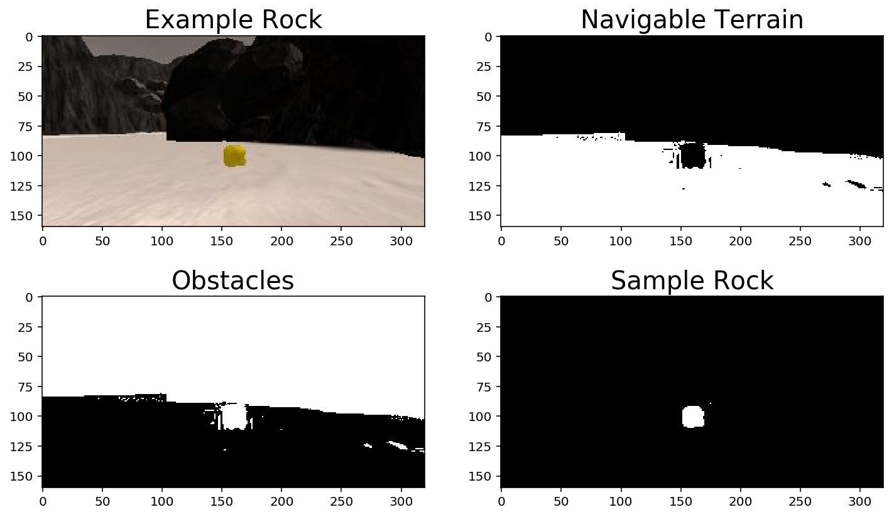

# Udacity Robotics Nanodegree - Rover Project

## Quickstart
1. To access the notebook, you need to go inside the `code` directory and run
 the following command in your shell:
 ```shell
 > jupyter notebook rover_project_test_notebook.ipynb
 ```
2. To enable autonomous mode in the simulator, you need to go inside the `code`
 directory and run the following command in your shell:
 ```shell
 > python drive_rover.py
 ```

 ## Simulator Setting
 The graphic setting when image data recorded is portrayed below:
 

## Notebook Analysis

### Obstacle Identification
The function `to_obstacle()` is added in the notebook and it receives binary
image as the result of `navigable_threshold()`. The way `to_obstacle()` identify
obstacles is by the following method:
1. Create a boolean array that has the value "True" when the binary image has
 the value of "0", which is a marker that the pixel is not navigable and thus,
 an obstacle.
2. Indexing a scaffold image using the boolean array at step 1 and set the value
 to "1" to mark a pixel representing an obstacle.

### Rock Identification
The function `sample_rock_threshold()` is added in the notebook and it receives
an image that would be going through a series of analysis to identify rock
samples and returning a binary image with the value "1" to marks the presence of
rock samples. Here are how the function works:
1. Create a boolean array that has the value of "True" when the image's pixel
 has an RGB value that is within (100,100,0) and (255,255,80).
2. Indexing a scaffold image using the boolean array at step 1 and set the value
 to "1" to mark a pixel representing a rock sample.

### `process_image()`
The `process_image()` function is filled with the following steps:
1. Creating a scaffold image/a blank image to be returned as a mosaic image
2. Apply color thresholding to identify navigable terrain/obstacles/rock
 samples. This is done prior to perspective transform, so that the rover-vision
 image would have only the obstacles with the color red and not the black pixels
 from the warped images.
3. Apply perspective transform
4. Create the rover-vision image to be displayed at the top left corner of the
 mosaic image
5. Obtain world coordinates of the rover-vision by first obtaning the
 rover-centric coordinates
6. Update the worldmap image, overlay it with the groundmap, and display it at
the bottom center of the mosaic image

## Autonomous Navigation and Mapping
The `perception_step()` is basically filled with code that uses the same steps
as the `process_image()` and the `decision_step()` is basically unchanged, since
it is enough for the bare minimum functionality.